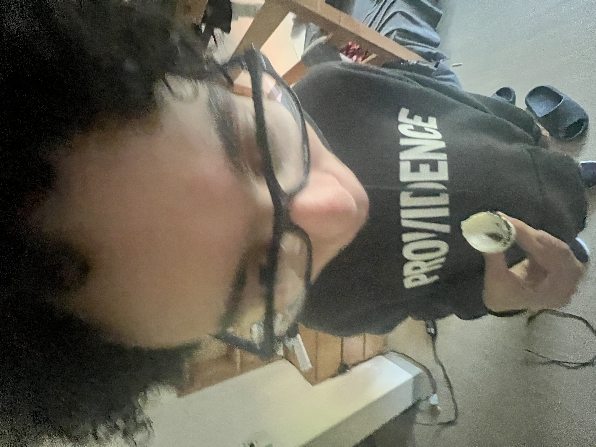
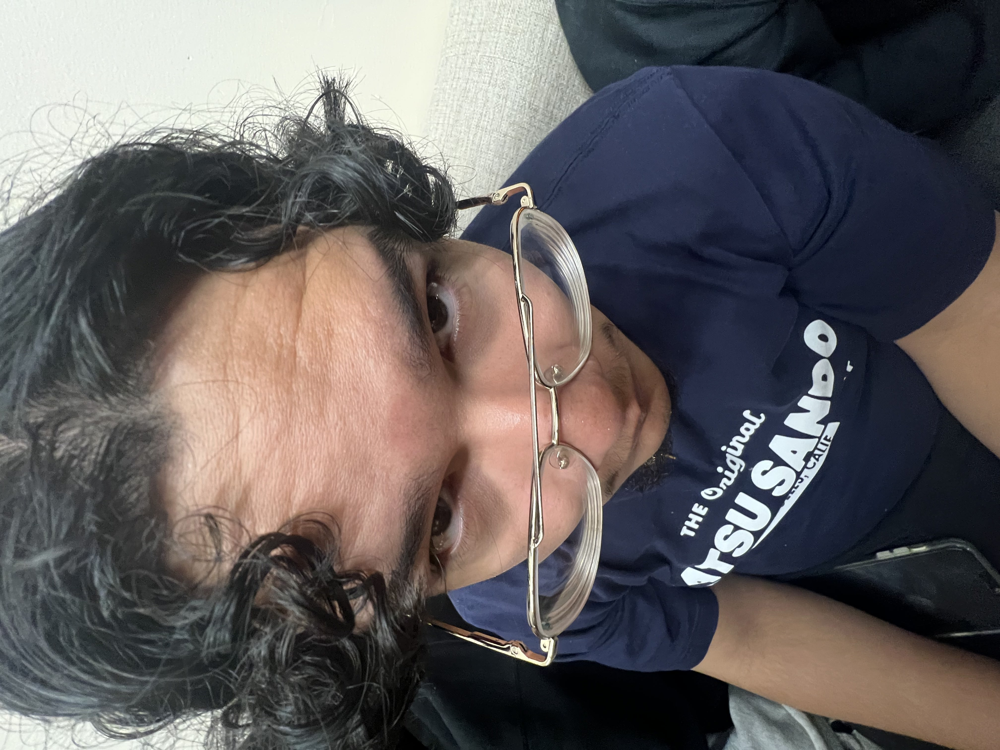

# PechaKucha

```{include} _static/play_pause.html
```

```{card}
:class-card: slide


```

```{card}
:class-card: slide


```

```{card}
:class-card: slide


```

```{card}
:class-card: slide


```

```{card}
:class-card: slide


```

```{card}
:class-card: slide


```

```{card}
:class-card: slide


```

```{card}
:class-card: slide


```

```{card}
:class-card: slide


```

```{card}
:class-card: slide


```

```{card}
:class-card: slide


```

```{card}
:class-card: slide


```

```{card}
:class-card: slide


```

```{card}
:class-card: slide


```
```{card}
:class-card: slide


```

```{card}
:class-card: slide


```

```{card}
:class-card: slide


```

```{card}
:class-card: slide


```

```{card}
:class-card: slide


```

```{card}
:class-card: slide


```

```{card}
:class-card: slide


```